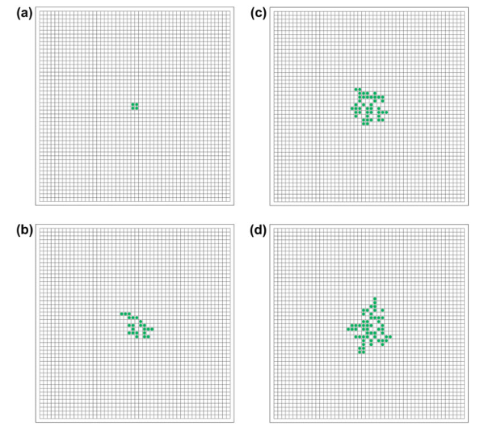
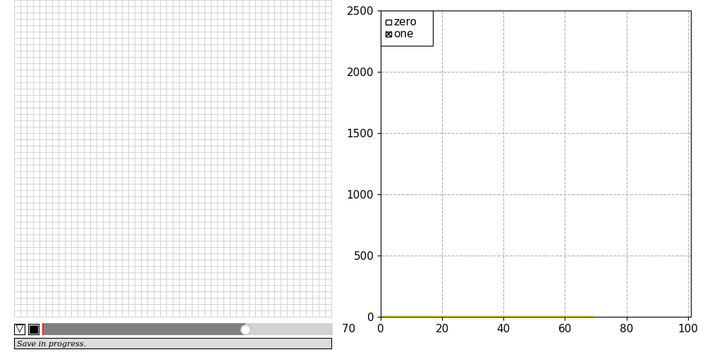

# Physarum polycephalum CA model [^1]
[^1]: Shirakawa, T., Sato, H., & Ishiguro, S. (2015). 
Construction of living cellular automata using the Physarum plasmodium. 
International Journal of General Systems, 44(3), 292-304. 
https://doi.org/10.1080/03081079.2014.997531

## Model 1

transition probabilities from table 1:

| State transition / Present to next | 0     | 1     | 2     | 3     | 4     |
| ----------------|-------|-------|-------|-------|-------|
| 0 to 0         | -| 0.987 | 0.976 | 0.954 | 0.979 | 
| 0 to 1         | - | 0.013 | 0.024 | 0.046 | 0.021 | 
| 1 to 0         | 0.124 | 0.041 | 0.016 | 0.008 | 0.002 |
| 1 to 1         | 0.876 | 0.959 | 0.984 | 0.992 | 0.998 |

The behavior should be like:

Current behavior (with VonNeumann neighborhood):

failed to replicate
